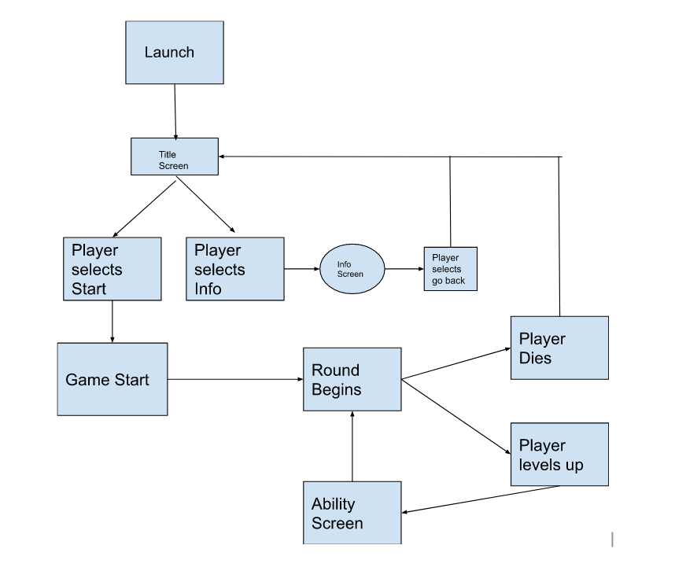
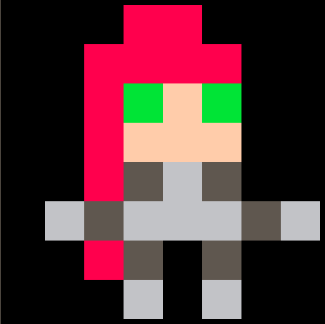
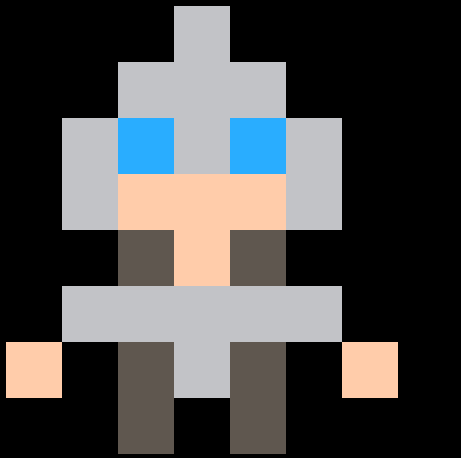

# Concept Sketch 

## **Sinister Steel**

### **Log line**
Sinister Steel is a simple top-down battle arena that gets more intense with each round.

### **Vision**

This game utilizes a character from the game League of Legends. The game is centered around Katarina, an assassin known for having style and finesse with blades. Gameplay involves the player as Katarina, surrounded by enemies, and then the player must then fight off enemies as they come in waves. Similar to League, as the player continues battle to they will "level up" unlocking more abilities to use. This game is different from league as it is very fast paced and intense early. The abilities will stay the same, once level 4 is reached, the player unlocks their ultamite ability. 

The mechanics revolve around the use of Katarina's blades. Starting out, the player can only simple attack, spinning in a circle and hitting all enemies around them. One ability causes blades to linger on the ground, Katarina can then go to the blade and automatically spin to attack in a slightly larger area of effect. 

The setting of the game is simply a battlefield in which Katarina has found herself surrounded by enemies. Now, it is time to style on them. Since this is a fantasy world, there may be enemies that use magical abilities. The map and setting remain the same, only the difficulty and amount of enemies change as time goes on.

The game is made in PICO-8 so, visuals are simple. There are limits to pixel art, but hopefully the movement of enemies and the player will feel fluid enough to add to the overal atmosphere and feel of Katarina's character. Like in League of Legends, as Katarina gets more powerful, her speed grows exponentially. This game should feel similar in that it is very fast past, however with little room for error. Players must think of where to continue to attack enemies without leaving themselves exposed to damage, as one hit will kill the player, ending their run.

----

## **Gameplay**

### **Overview**
Gameplay here includes the player starting the first wave. Enemies will begin surrounding the player and forcing combat. Early on, the enemies will be weak, dying in one-hit and leaving more time before attempting to inflict damage on the player. The player can only do one attack in the first round, spinning in a circle to do damage in a small circle around them. As the player continuously gets kills, they will build towards leveling up, and unlocking one of Katarina's abilities. The player has a 360 degree map to move on with plenty of room to dodge enemies as necessary. However, it is encouraged to continuously engage in combat as the amount of enemies spawned will continue to ramp up. 

### **Description**
The player begins the round by pressing a button (yet to be determined). The player will start in the center of the map and enemies will begin to surround. the player can then move or sit still and attack enemies as they get close. There will be a fixed amount of enemies for each round, after the player removes all enemies, the next wave will begin. Abilities include: Katarina can now throw knives. Thrown knives will damage enemies and linger on the ground, (used for a future abiility). If Katarina goes to a knife, she will pick it up and do the same circle attack around in a slightly larger AOE. Shunpo: the ability to instantly teleport to a knife and automatically attack in an even larger AOE around her. The final  ability is Katarina's ultimate: Death Lotus. This ability will have a cooldown. Katarina will stay in place for a few seconds and continuosly spin throwing blades in all directions. ALL these blades will linger after for Kataring to shunpo to after. 

### **Controls**
The player will use the following control scheme:

| Key        |   | Action   |
|------------|---|----------| 
|            |   |          |
|     Up     |   | Move Up  |
|    Down    |   | Move Down|
|     Left   |   | Move left|
|     Right  |   | Move right|
|   X        |   | Attack/Ability
|   C        |   | Change ability

- These simple controls and combine of controls will allow for more free combo building for the player.

**Ability1**: Lingering Blade, Katarina throws a knife that pierces enemies, and stays on the ground after one enemy is hit.

**Ability2**: Preparation, Katarina leaves a knife where she is standing.

**Ability3**: Shunpo, Katarina will instantly teleport to the closest blade.

**Ultimate**: Death Lotus, Katarina stands in place and throws knives in all directions for 3 seconds.

---

### **Levels**

Levels will work like that similar to Black Ops Zombies. Waves of enemies will approach and the player levels up Katarina as they full clear waves of enemies. Rounds will continuosly gain difficulty and the game ends with the death of the player.

### **Flow chart**

---

## **Characters**
 

### Character design and Types
### Player Character: Katarina

### Attributes: (see controls)
    - Basic attack

    - Knife throw
        ranged attack

    - Shunpo 
        teleport to knife

    - Ultimate 
        throw constant knives in a circle

### NPC: Legion Guard

### Attributes:
    - Basic attack

    - More health
        May take 2 hits to kill

### Behaivior
    - Aggressive
        Constantly attacking player
        Will always follow player
 

### NPC: Legion Archer (no image yet)
    - Basic attack
        ranged

    - Low health
        Will stay a fixed distance from player

### Behaivior
    - Ranged
        Constantly attacking player with arrows
        Will attempt to distance themselves from player
---
## **World Overview**

Essentially, the map will remain the same. It will take place in a large open field, utalizing as much of the map screen as possible to allow maximum freedom of movement for the player. Beyond cosmetic, there will be little interaction with the world. This takes place solely on a battlefield.

### Key locations (purely cosmetic and to enforce borders)

- Castle walls
- Ocean

### Travel
Travel is within the arena map of the game. The player can freely travel the area.

### Scale
Utalizing as much room as possible, the map will cover as much as pico-8 will allow. 
This gives players better options to dodge and engage enemies.

---
## Media List

### Art direction
As demonstrated above, majority of art are in the pixel style within the constraits of Pico-8. All sprites are created in the sprite editor of Pico-8 and will be used accordingly.

### Interface assests and related Sprites

These are the main interface assets intended:

- Start menu
    - This menu is where players can wither begin the game, or choose to see the iu
    instructions screen
- Instructions screen
    - This screen will have a list of controls and gameplay overview
- In-game ability tracker
    - This is a simple display in game UI to show the player whihc ability they have currently selected

### Environments and related Sprites

- Simple grass terrain sprites
- Castle walls
    - World border functionality
- Ocean water sprites
    - World border functionality
- Rubble sprites
    - Collidable blocks to prevent movement

### Characters and related Sprites
- Player character
    - Ground-knife, the player can walk over to lingering knife and pick it up, auto attacking
    - Throwable knife, corresponds to ability 1, this knife will change to a Ground-knife if it hits an enemy
- NPCs 
    - Each NPC has a corresponding sprite, each will follow and attack player.
    - Ranged NPCs will have arrow sprites that act similar to the throwable knives.

### Animation
- Player character
    - The player character has 3 sprites for movement animations (sprites 4-6)
- NPCs
    - NPCs do not currently have animated sprites
    - Ranged NPC arrows will have movement
- Enviromental 
    - Ocean area may have animated sprites for water movement
- Music and SFX
    - Simple sound effects will be used for the following:
        - Game start
        - Game end
        - Player Death
        - Basic attack
        - Ultimate

        

 

