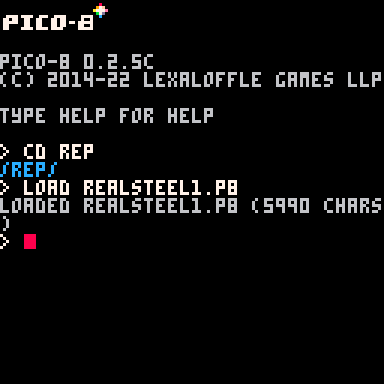

# How to play

### Movement:

| Key        |   | Action   |
|------------|---|----------| 
|            |   |          |
|     Up     |   | Move Up  |
|    Down      |   | Move Down|
|     Left    |   | Move left|
|     Right   |   | Move right|
| Left Mouse || Throw Knife
| Right Mouse || AOE attack
|   X | | Shunpo

- Note: These controls are subject to change
---
### Known bugs: Right mouse attack does not connect with enemies or work at all.

Game demo:

[Sinister Steel](/game/realsteel1.html) \| [v0.2](https://github.com/matrom01-v2/Pico-8Site/releases/tag/v0.2)

